# Proyecto Final COM480
## Integrantes
1. Crespo Rejas Jhamil - Ing. Ciencias de la Computación
2. Calderón Flores Enrique Antonio - Ing. Ciencias de la Computación
# Hardware del Sistema de control de Ekran
El sistema de control de Ekran está diseñado para operar un mecanismo de apertura y cierre mediante un motor paso a paso, con detección de obstrucciones y comunicación por red. A continuación, se detalla el hardware utilizado, junto a su configuración y funcionamiento.


## Componentes del Hardware
### 1. **Arduino Uno**
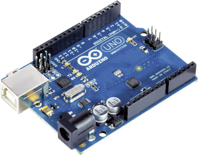

- **Descripción**: La placa Arduino Uno, basada en el microcontrolador ATmega328P, es el cerebro del sistema. Gestiona la lógica de control, la comunicación por Ethernet, la lectura del sensor de vibración, el control del motor paso a paso, y las señales visuales y auditivas (LEDs y buzzer).
- **Función**: Ejecuta el firmware que coordina todas las tareas, desde la inicialización de los componentes hasta la atención de peticiones HTTP y la gestión de interrupciones por obstrucción.
- **Conexiones**: Los pines digitales y analógicos se utilizan para conectar los sensores, actuadores y módulos adicionales, configurados en el `setup()` del código Arduino.

### 2. **Placa Ethernet (Shield Ethernet)**
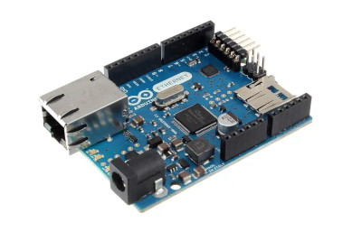

- **Descripción**: Se utiliza un shield Ethernet compatible con el Arduino Uno, para permitir la comunicación en red local.
- **Función**: Convierte el Arduino en un servidor HTTP que escucha peticiones en el puerto 80, permitiendo el control remoto desde una interfaz web. Utiliza una dirección IP fija (por ejemplo, `192.168.0.40`) para facilitar el acceso.
- **Configuración**: Se conecta directamente al Arduino Uno mediante los pines de la interfaz ICSP y los pines digitales/analógicos. La librería `Ethernet.h` gestiona la comunicación.
- **Detalles**: El shield asegura una conexión estable en la red local, soportando protocolos TCP/IP y permitiendo endpoints como `/abrir`, `/cerrar`, `/reset` y `/status`.

### 3. **Buzzer (Tono Único)**
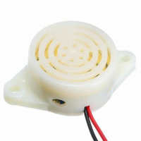

- **Descripción**: El buzzer es un componente piezoeléctrico pasivo que emite un tono único (no modulable en frecuencia, tipo "buzzer chino"). Es de color blanco y se conecta mediante una bornera para facilitar su integración.
- **Función**: Actúa como una alarma audible que se activa cuando se detecta una obstrucción (vibración detectada por el sensor KY-02). Suena de manera intermitente (6 ciclos de 150 ms encendido/apagado) para alertar al usuario.
- **Funcionamiento**: 
  - Conectado al pin digital 5 (salida), el buzzer se activa con un nivel lógico alto (`HIGH`) y se apaga con un nivel bajo (`LOW`).
  - No requiere control de frecuencia, ya que produce un tono fijo característico.
  - La lógica no bloqueante en el código asegura que el buzzer suene sin interrumpir otras tareas del Arduino.
- **Conexión**: Se conecta a través de una bornera de dos terminales, con un polo a GND y el otro al pin 5.

### 4. **Sensor de Vibración KY-02**
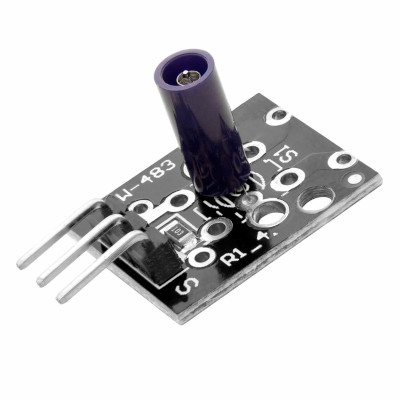

- **Descripción**: El KY-02 es un sensor de vibración simple que detecta movimientos o golpes físicos. Funciona como un interruptor que cierra el circuito cuando percibe vibración.
- **Función**: Detecta posibles obstrucciones durante el movimiento del motor. Si se detecta vibración mientras el motor está en movimiento, el sistema detiene el motor, activa el buzzer y el LED rojo, y entra en estado de bloqueo.

- **Funcionamiento**:
  - Conectado al pin digital 8 con modo `INPUT_PULLUP`, el sensor produce una señal `LOW` cuando detecta vibración (cierra el circuito a GND) y `HIGH` en reposo.
  - La resistencia pull-up interna del Arduino evita lecturas inestables cuando el circuito está abierto.
  - La lógica del programa verifica el estado del sensor en cada ciclo del `loop()` para reaccionar rápidamente ante obstrucciones.
- **Conexión**: Se conecta a través de pines headers en el shield personalizado, con un cable a GND y otro al pin 8.

### 5. **Motor Paso a Paso Nema 17**
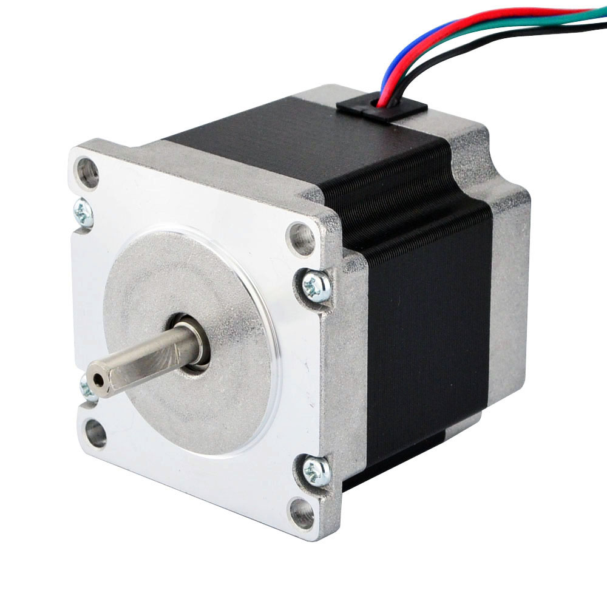

- **Descripción**: El motor Nema 17 es un motor paso a paso bipolar con 4 cables (dos bobinas: A+, A-, B+, B- ). Es ideal para aplicaciones que requieren movimientos precisos, como el mecanismo de apertura/cierre del sistema Ekran.
- **Función**: Realiza movimientos controlados para abrir o cerrar el mecanismo, gestionado por la librería `AccelStepper` para un desplazamiento suave con aceleración y velocidad definidas.
- **Funcionamiento**:
  - **Bipolar**: Sus 4 cables corresponden a dos bobinas, lo que confirma que es un motor bipolar. Cada bobina debe ser energizada en una secuencia específica para girar el eje.
  - **Pasos por revolución**: Típicamente 200 pasos por revolución (1.8° por paso), aunque puede configurarse con microstepping para mayor precisión.
  - **Control**: Se controla mediante un driver que recibe señales de paso (`STEP`) y dirección (`DIR`) desde los pines 3 y 2 del Arduino, respectivamente.
  - La librería `AccelStepper` configura una velocidad máxima de 400 pasos/s y una aceleración de 600 pasos/s², asegurando movimientos suaves.
- **Conexión**: Los 4 cables del motor se conectan a una bornera en el shield personalizado, que a su vez se conecta al driver.

### 6. **Driver para Motor Paso a Paso**
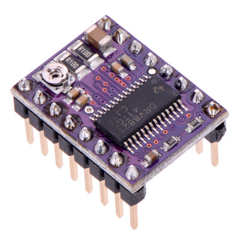

- **Descripción**: Un driver de motor paso a paso (como el A4988 o DRV8825) se utiliza para controlar el Nema 17, proporcionando la corriente y las señales necesarias para mover el motor.
- **Función**: Interpreta las señales de paso (`STEP`) y dirección (`DIR`) enviadas por el Arduino para energizar las bobinas del motor en la secuencia correcta.
- **Funcionamiento**:
  - **Señales de control**:
    - Pin 3 (`STEP`): Cada pulso alto en este pin avanza el motor un paso (o microstep, si está configurado).
    - Pin 2 (`DIR`): Define la dirección del movimiento (`HIGH` para un sentido, `LOW` para el opuesto).
  - **Microstepping**: El driver puede configurarse para dividir cada paso en fracciones (por ejemplo, 1/16) ajustando resistencias o puentes en el módulo, aumentando la precisión.
  - **Alimentación**: Recibe 12 V desde una fuente externa (a través de una bornera) y regula la corriente para evitar sobrecalentamiento del motor.
  - **Protección**: Incluye protección contra sobrecorriente y sobrecalentamiento, ajustable mediante un potenciómetro en el driver.
- **Conexión**: Se conecta al motor mediante una bornera de 4 terminales (para los cables A+, A-, B+, B- ) y al Arduino mediante headers para las señales `STEP` y `DIR`. En este proyecto no se usa los microsteps, por tanto estan conectados a tierra.

### 7. **Capacitor Electrolítico de 100 µF**
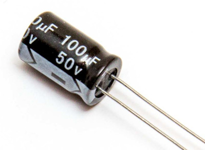

- **Descripción**: Un capacitor electrolítico de 100 µF se incluye en el circuito para filtrar ruido eléctrico en la fuente de alimentación.
- **Función**: Estabiliza la tensión de entrada, reduciendo picos de voltaje o interferencias que podrían afectar el funcionamiento del Arduino, el driver o el motor.
- **Ubicación**: Conectado en paralelo entre los terminales de alimentación (VCC y GND) de la fuente externa de 12 V, cerca de la bornera de alimentación.
- **Funcionamiento**: Absorbe fluctuaciones de corriente, especialmente durante los picos de consumo del motor, asegurando un suministro estable.

### 8. **LEDs Indicadores**
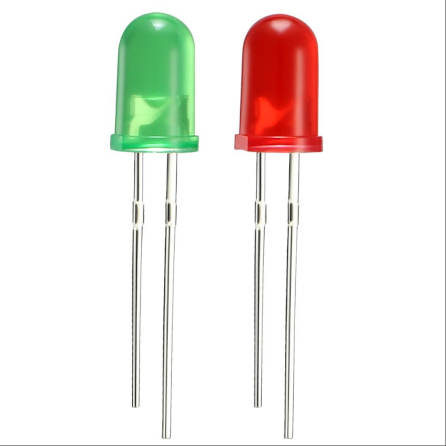

- **Descripción**: Dos LEDs indicadores se utilizan para señalar el estado del sistema:
  - **LED Verde** (pin 4): Indica que el sistema está funcionando normalmente (estado `LISTO` o en operación sin obstrucciones).
  - **LED Rojo** (pin 6): Se enciende cuando se detecta una vibración (obstrucción) y el sistema entra en estado de bloqueo.
- **Función**:
  - El LED verde está encendido por defecto tras la inicialización y se apaga temporalmente durante un bloqueo.
  - El LED rojo se activa junto con el buzzer cuando el sensor KY-02 detecta vibración, alertando al usuario.
- **Conexión**: Ambos LEDs están conectados a través de resistencias limitadoras de corriente con un valor de 220 Ω a los pines digitales correspondientes, con el cátodo a GND.

### 9. **Borneras y Headers (Shield Personalizado)**

<div style="float: right; margin-left: 10px;">
  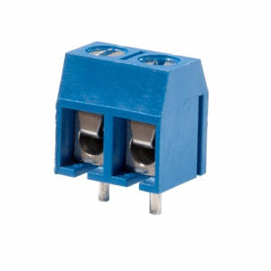
  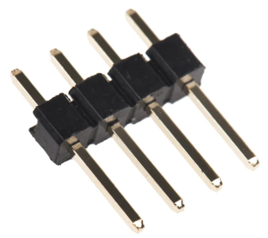
  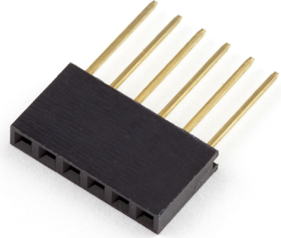
</div>

- **Descripción**: El sistema incluye un shield personalizado que actúa como un "tercer piso" encima del shield Ethernet, facilitando las conexiones de los componentes.
- **Componentes del Shield**:
  - **Headers**: 
    - **Pines macho**: Se utilizan para conectar directamente a los pines del Arduino Uno, permitiendo que el shield personalizado se incruste sobre los pines del Arduino como parte del diseño apilable del "shield customizado". Estos pines macho se emplean para conectar componentes como los LEDs, las señales del driver (`STEP` y `DIR`), y cualquier otro elemento que requiera un pin del Arduino.
    - **Pines hembra**: Hay 3 pines hembra diseñados para conectar el sensor KY-02 a la placa. Desde estos pines hembra, las conexiones se dirigen a los pines macho que se vinculan con el Arduino. Además, se incluye un espacio con pines hembra para incrustar el driver, ya que este viene con pines macho soldados, facilitando su montaje en el shield.
  - **Borneras**:
    - **Bornera para el motor (4 terminales)**: Conecta los 4 cables del Nema 17 (A+, A-, B+, B- ) al driver.
    - **Bornera de alimentación externa (4 terminales)**: Recibe 12 V desde una fuente tipo cargador (con conector de barril o similar) para alimentar el driver y el motor. Incluye el capacitor de 10 µF en paralelo para filtrar ruido.
    - **Bornera para el buzzer (2 terminales)**: Conecta el buzzer piezoeléctrico al pin 5 y GND.
- **Función**: El shield personalizado organiza las conexiones, reduce el uso de cables sueltos y facilita el mantenimiento o reemplazo de componentes. Su diseño apilable asegura compatibilidad con el Arduino Uno y el shield Ethernet.
<div style="clear: both;"></div>

### 10. **Fuente de Alimentación Externa**
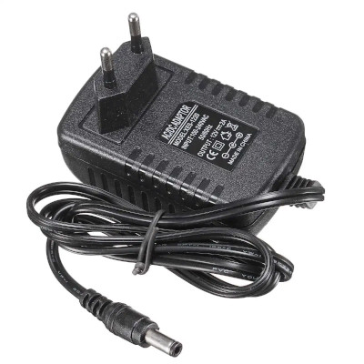

- **Descripción**: Una fuente de alimentación de 12 V (tipo cargador) proporciona la energía necesaria para el motor Nema 17 y el driver.
- **Función**: Alimenta el driver del motor, que regula la corriente para las bobinas del Nema 17. El Arduino y el shield Ethernet se alimentan por separado (típicamente vía USB o una fuente de 5 V).
- **Conexión**: Se conecta a través de una bornera de 4 terminales en el shield personalizado, con el capacitor de 10 µF en paralelo para estabilizar la tensión.

## Diagrama de Conexiones

### Diseño Físico (Shield Personalizado)
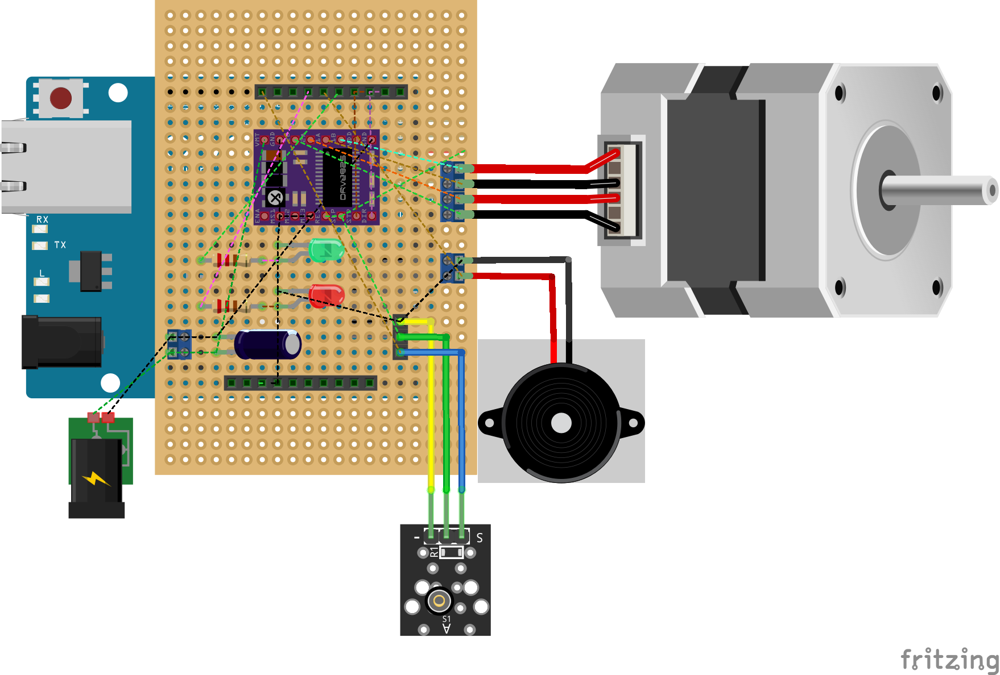
### Esquema Eléctrico
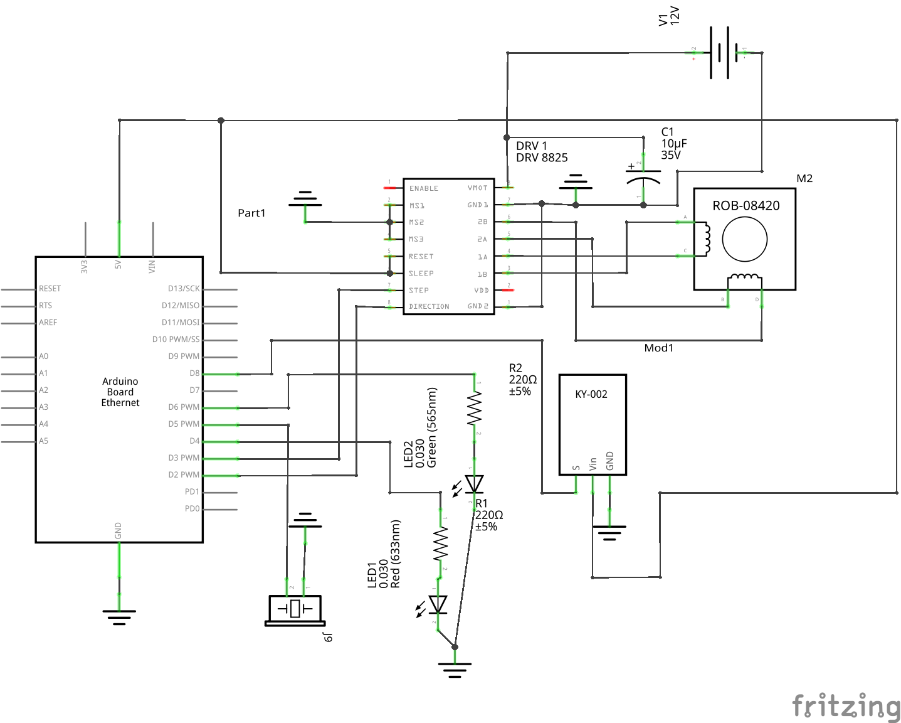

A continuación, se describe la integración de los componentes:

- **Arduino Uno**: Base del sistema, conectado al shield Ethernet mediante pines ICSP y digitales/analógicos.
- **Shield Ethernet**: Apilado directamente sobre el Arduino, conectado a la red local vía un cable Ethernet.
- **Shield Personalizado**: Apilado sobre el shield Ethernet, con headers para el sensor KY-02, LEDs, y señales del driver (`STEP`, `DIR`). Incluye borneras para:
  - Motor Nema 17 (4 terminales).
  - Fuente de alimentación externa de 12 V (2 terminales, con capacitor de 10 µF).
  - Buzzer (2 terminales).
- **Motor Nema 17**: Conectado al driver mediante la bornera de 4 terminales.
- **Driver**: Recibe señales `STEP` (pin 3) y `DIR` (pin 2) desde el Arduino y alimentación de 12 V desde la bornera.
- **Sensor KY-02**: Conectado al pin 8 (con `INPUT_PULLUP`) y GND mediante headers.
- **LEDs**: Conectados a los pines 4 (verde) y 6 (rojo) con resistencias limitadoras.
- **Buzzer**: Conectado al pin 5 y GND mediante una bornera.
- **Capacitor de 10 µF**: En paralelo con la bornera de alimentación de 12 V.


## Consideraciones de Diseño
- **Modularidad**: El uso de un shield personalizado con headers y borneras facilita la conexión/desconexión de componentes y el mantenimiento.
- **Estabilidad**: El capacitor de 10 µF y la fuente externa de 12 V aseguran un suministro estable, crítico para el motor y el driver.
- **Seguridad**: La detección de obstrucciones mediante el sensor KY-02, combinada con el buzzer y el LED rojo, protege el sistema contra daños físicos.
- **Escalabilidad**: La estructura del shield permite añadir más sensores o actuadores si es necesario, utilizando los pines disponibles del Arduino.

Este diseño de hardware es robusto, eficiente y adecuado para el control remoto y seguro del sistema Ekran, integrando todos los componentes de manera organizada y funcional.

# Software del Sistema de control de Ekran

## 1. Introducción al Sistema de Control

En esta sección se documenta el funcionamiento del software tanto a nivel del código del Arduino como de la interfaz web, detallando su lógica, organización y flujo de trabajo. La documentación está orientada a permitir que cualquier persona con conocimientos técnicos pueda entender, modificar o escalar el proyecto en el futuro.

A continuación se describen brevemente los dos componentes clave del sistema:

* **Servidor embebido en Arduino:**
La placa Arduino actúa como servidor HTTP que escucha peticiones desde la red local. Está encargado de ejecutar las acciones solicitadas (abrir o cerrar el motor), detectar posibles obstrucciones mediante un sensor de vibración, gestionar el buzzer y los LEDs, y mantener actualizada la información del estado general del sistema.

* **Interfaz gráfica web:**
Se trata de una aplicación HTML + CSS + JavaScript ligera, que permite al usuario visualizar el estado del sistema y enviar comandos de forma intuitiva. Esta interfaz se comunica con el Arduino a través de peticiones HTTP, interpreta las respuestas en formato JSON y actualiza dinámicamente su contenido para reflejar el estado del sistema.

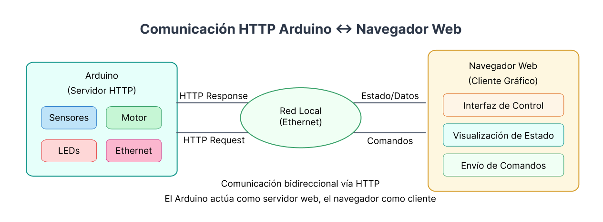

## 2. Descripción General del Funcionamiento

El sistema inicia con la configuración del hardware y la inicialización de la red Ethernet. A partir de ese momento, entra en un ciclo de ejecución continuo que sigue una secuencia priorizada de tareas, permitiendo el control del motor paso a paso, la detección de obstrucciones mediante un sensor de vibración, y la atención a comandos enviados desde la interfaz web.

### Flujo de operación básico

1. **Inicio del sistema:**

   * Configuración de pines, motor, sensores y LEDs.
   * Inicialización de la conexión Ethernet.
   * Prueba de arranque con señales visuales.

2. **Ciclo continuo (`loop()`):**

   * **Prioridad 1:** Ejecutar movimiento del motor si hay una operación pendiente.
   * **Prioridad 2:** Verificar el estado del sensor de vibración en busca de obstrucciones.
   * **Prioridad 3:** Procesar comandos pendientes enviados por el usuario.
   * **Prioridad 4:** Atender solicitudes HTTP de la interfaz (solo si el motor no se está moviendo).

3. **Gestión de estados:**

   * Si se detecta una obstrucción, se detiene el motor, se activa el buzzer y se muestra el estado de bloqueo durante 3 segundos antes de reanudar la operación.
   * Si el motor completa su movimiento correctamente, se actualiza el estado del sistema y se apagan señales de advertencia.

### Subsistemas del sistema

* **Gestión del motor paso a paso:**
  Controlado por la librería `AccelStepper`, permite abrir y cerrar un mecanismo mediante comandos remotos o locales. Se realiza un seguimiento preciso de la posición.

* **Sensor de vibración:**
  Se utiliza para detectar obstrucciones o interferencias físicas. Si se detecta una vibración mientras el motor se mueve, el sistema se bloquea temporalmente por seguridad.

* **Sistema de bloqueo automático:**
  En caso de obstrucción, se activa el buzzer y los LEDs de advertencia. Luego de 3 segundos, el sistema se reinicia automáticamente si no se ha retirado manualmente.

* **Comunicación por Ethernet:**
  El Arduino actúa como servidor HTTP y responde a peticiones provenientes de la interfaz gráfica. Esto permite controlar el sistema sin necesidad de botones físicos.

* **API HTTP:**
  Proporciona endpoints sencillos:

  * `/abrir` → Inicia la apertura.
  * `/cerrar` → Inicia el cierre.
  * `/reset` → Restaura el sistema tras un bloqueo.
  * `/status` → Devuelve el estado actual en formato JSON.

## 3. Código del Arduino (Servidor embebido)

### 3.1 Configuración inicial (`setup()`)

La función `setup()` del código Arduino se ejecuta una sola vez al iniciar el sistema. Su propósito es realizar todas las configuraciones necesarias para que los distintos componentes del hardware y las comunicaciones comiencen en un estado operativo y seguro. En este proyecto, se configuran los pines de entrada/salida, el motor paso a paso, el servidor Ethernet, y se establece el estado inicial del sistema.

#### Configuración de pines

Los pines digitales se configuran para controlar los siguientes componentes:

| Componente          | Pin Digital | Modo de Configuración                      |
| ------------------- | ----------- | ------------------------------------------ |
| Motor - STEP        | 3           | Salida (usado por librería `AccelStepper`) |
| Motor - DIR         | 2           | Salida (usado por librería `AccelStepper`) |
| Sensor de vibración | 8           | Entrada con `INPUT_PULLUP`                 |
| Buzzer              | 5           | Salida                                     |
| LED Verde           | 4           | Salida                                     |
| LED Rojo            | 6           | Salida                                     |

La configuración `INPUT_PULLUP` para el sensor de vibración es esencial, ya que este tipo de sensor trabaja cerrando el circuito a tierra (GND) cuando detecta vibración. El pull-up interno evita lecturas inestables cuando el circuito está abierto.

#### Inicialización del motor paso a paso

Se usa la librería `AccelStepper` para controlar el motor con aceleración y velocidad definidas:

```cpp
stepper.setMaxSpeed(400);
stepper.setAcceleration(600);
stepper.setCurrentPosition(0);
```

Esto garantiza un movimiento suave y controlado, evitando saltos bruscos. Además, se define el número total de pasos necesarios para una apertura completa, permitiendo calcular posiciones relativas más adelante.

#### Estado inicial del sistema

Antes de iniciar el bucle principal, se establecen las siguientes condiciones:

* El LED verde se enciende, indicando que el sistema está listo.
* El LED rojo y el buzzer se apagan.
* Se muestra un mensaje de arranque en el monitor serial para facilitar la depuración.

#### Configuración de red y servidor HTTP

El Arduino se conecta a la red local utilizando una dirección IP fija, definida en el código:

```cpp
IPAddress ip(192, 168, 0, 40);
```

Esto permite saber con certeza la dirección desde la cual se puede acceder al servidor. El método `Ethernet.begin()` configura los parámetros de red, y `server.begin()` habilita el servidor HTTP que escuchará en el puerto 80.

Finalmente, se imprime en el monitor serial la dirección IP del dispositivo, confirmando que la conexión fue exitosa.

### Fragmento de código de referencia

```cpp
Ethernet.begin(mac, ip, gateway, gateway, subnet);
server.begin();

Serial.println(F("=== SISTEMA EKRAN API INICIADO ==="));
Serial.print(F("IP: "));
Serial.println(Ethernet.localIP());
```

### 3.2 Ciclo principal (`loop()`)

La función `loop()` en Arduino representa el núcleo operativo del sistema. Se ejecuta de forma continua e infinita mientras el dispositivo esté encendido. En este proyecto, el ciclo principal está cuidadosamente organizado por **prioridades**, lo que permite garantizar una respuesta eficiente tanto al control de hardware como a la comunicación con la interfaz web.

#### Orden de ejecución en el ciclo

El ciclo se estructura en cinco bloques de ejecución que se ejecutan secuencialmente, con un orden que refleja la criticidad de cada tarea:

1. **`moverMotor()`**
   Controla el desplazamiento del motor paso a paso si hay una orden de movimiento en curso.

2. **`verificarVibracion()`**
   Supervisa el estado del sensor de vibración para detectar obstrucciones y, si es necesario, interrumpe el movimiento.

3. **`procesarComandoPendiente()`**
   Evalúa si existe un comando almacenado (como “ABRIR” o “CERRAR”) y ejecuta la acción correspondiente.

4. **`atenderEthernet()`** *(condicional)*
   Atiende solicitudes HTTP desde la interfaz web. Esto se ejecuta **solo si el motor no está en movimiento**, para evitar conflictos de sincronización.

5. **`Ethernet.maintain()`**
   Mantiene activa la conexión de red DHCP (aunque en este caso se usa IP fija, sigue siendo buena práctica).

#### Lógica y razones del orden

* **Movimiento primero**:
  El motor necesita ser actualizado en cada ciclo a través de `stepper.run()` para que se desplace correctamente. Si no se ejecuta con prioridad, el motor no avanzaría como se espera.

* **Sensor de vibración inmediatamente después**:
  Es crítico detectar obstrucciones rápidamente mientras el motor se mueve. Este control evita daños físicos y activa las señales de advertencia.

* **Procesamiento de comandos en tercer lugar**:
  Esto permite almacenar un comando en espera y ejecutarlo solo cuando sea seguro (cuando el motor esté detenido y no haya obstrucción).

* **Atención a clientes HTTP como última prioridad operativa**:
  Esto evita interrupciones en tareas físicas sensibles como mover el motor o detectar vibraciones. Solo se permite cuando el sistema está estable.

#### Fragmento de código de referencia

```cpp
void loop() {
  moverMotor();                      // Prioridad 1
  verificarVibracion();             // Prioridad 2
  procesarComandoPendiente();       // Prioridad 3

  if (!motorMoviendose) {           // Prioridad 4 (condicional)
    atenderEthernet();
  }

  Ethernet.maintain();              // Mantenimiento de red
}
```
Excelente, avancemos con la **Sección 3.3: Lógica de control del motor paso a paso**. Esta sección está dedicada a explicar cómo se mueve el motor de forma precisa, cómo se interpretan los comandos de apertura/cierre, y cómo se actualiza el estado del sistema con base en la posición actual.


### 3.3 Lógica de control del motor

El movimiento del motor paso a paso es gestionado mediante la función `moverMotor()`, que se ejecuta en cada iteración del ciclo principal. Este subsistema es responsable de realizar los movimientos solicitados, controlar la posición actual y actualizar el estado del sistema tras cada desplazamiento.

#### Control del motor con AccelStepper

Se utiliza la librería `AccelStepper`, que permite controlar motores paso a paso con aceleración y velocidad definidas, evitando movimientos bruscos y asegurando precisión.

En la configuración inicial (`setup()`), ya se definió la velocidad máxima y la aceleración.

Durante la ejecución, la función `stepper.run()` debe llamarse continuamente para que el motor se desplace correctamente hasta su destino. Por eso, `moverMotor()` tiene la **más alta prioridad en el `loop()`**.

#### Estructura de la función `moverMotor()`

```cpp
void moverMotor() {
  if (motorMoviendose && !obstruccionDetectada) {
    stepper.run();
    
    if (stepper.distanceToGo() == 0) {
      motorMoviendose = false;
      posicionActual = stepper.currentPosition();
      // Actualizar estado del sistema
      ...
    }
  }
}
```

La función se activa únicamente si:

* Hay un comando en curso (`motorMoviendose == true`), y
* No hay obstrucción detectada.

Una vez que el motor llega a su destino (`distanceToGo() == 0`), el sistema detiene el movimiento y actualiza la posición actual y el estado textual (`estadoSistema`).

#### Clasificación del estado del sistema

Tras finalizar el movimiento, el sistema evalúa la posición del motor para asignar uno de los siguientes estados:

* **CERRADO:** posición cerca de 0 pasos.
* **ABIERTO:** posición cercana a `pasosApertura`.
* **PARCIAL:** cualquier posición intermedia.

Esto es útil tanto para mostrar información en la interfaz como para decidir si el siguiente comando es válido.

```cpp
if (posicionActual <= 50) {
  estadoSistema = "CERRADO";
} else if (posicionActual >= pasosApertura - 50) {
  estadoSistema = "ABIERTO";
} else {
  estadoSistema = "PARCIAL";
}
```

Además, se reestablece el LED verde y se apaga el LED rojo, indicando que el sistema vuelve a estar listo.

#### Variables importantes

| Variable          | Descripción                                      |
| ----------------- | ------------------------------------------------ |
| `pasosApertura`   | Total de pasos necesarios para apertura completa |
| `posicionActual`  | Posición actual del motor (pasos)                |
| `motorMoviendose` | Flag que indica si hay un movimiento en curso    |
| `estadoSistema`   | Texto informativo sobre el estado del motor      |

#### Ejemplo de ejecución completa

1. El usuario envía un comando `ABRIR`.
2. El sistema llama a `stepper.moveTo(pasosApertura)`.
3. En cada ciclo del `loop()`, se ejecuta `stepper.run()` hasta alcanzar el destino.
4. Al finalizar, se actualiza la posición y el estado.
5. El motor se detiene automáticamente y se activan los LEDs correspondientes.

### 3.4 Manejo de obstrucciones y control del buzzer

La función `verificarVibracion()` se encarga de supervisar el **sensor de vibración** en tiempo real y de activar el **buzzer** y los **LEDs de advertencia** en caso de detectar una obstrucción durante el movimiento del motor. Esta lógica de protección impide que el motor siga moviéndose cuando hay algún bloqueo físico, lo que puede evitar daños estructurales.

#### Funcionamiento general

La función tiene dos bloques principales:

  1. **Manejo del buzzer en modo no bloqueante** (funciona como una alarma intermitente mientras el sistema está bloqueado).
  2. **Verificación del sensor de vibración** y lógica de reacción ante una obstrucción.

#### 1. Manejo del buzzer

El buzzer se activa solo si el sistema detecta una obstrucción, y se apaga automáticamente después de sonar tres veces (6 cambios on/off, cada uno cada 150 ms).

**Referencia al codigo:**

```cpp
if (buzzerActivo) {
  if (millis() - buzzerTiempo >= BUZZER_INTERVALO) {
    // Cambia estado del buzzer
    ...
    if (buzzerCiclos >= 6) {
      digitalWrite(BUZZER_PIN, LOW);
      buzzerActivo = false;
    }
  }
}
```

Esta lógica **no bloquea** el flujo del `loop()`, lo que permite que el sistema siga funcionando mientras el buzzer está activo.

#### 2. Verificación del sensor de vibración

El sensor KY-02 está conectado con `INPUT_PULLUP`, por lo que su salida es `LOW` (falsa) cuando detecta vibración.

**Cuando se detecta una vibración mientras el motor se mueve:**

* Se detiene el motor inmediatamente.
* Se guarda la posición actual.
* Se activa el buzzer y el LED rojo.
* Se cambia el estado del sistema a **BLOQUEADO**.
* Se inicia un temporizador de 3 segundos.

```cpp
if (!sensorVibracion && motorMoviendose && !obstruccionDetectada) {
  stepper.stop();
  posicionActual = stepper.currentPosition();
  motorMoviendose = false;
  obstruccionDetectada = true;
  tiempoObstruccion = millis();
  ...
}
```

#### Restauración automática

Después de 3 segundos (`TIEMPO_BLOQUEO`), el sistema se reinicia automáticamente:

* Se apaga el LED rojo.
* Se enciende el LED verde.
* Se actualiza el estado a **LISTO**.
* Se permite nuevamente el movimiento del motor.

```cpp
if (obstruccionDetectada && millis() - tiempoObstruccion >= TIEMPO_BLOQUEO) {
  obstruccionDetectada = false;
  digitalWrite(LED_ROJO_PIN, LOW);
  digitalWrite(LED_VERDE_PIN, HIGH);
  estadoSistema = "LISTO - PASO " + String(posicionActual);
}
```

#### Variables importantes

| Variable               | Descripción                             |
| ---------------------- | --------------------------------------- |
| `buzzerActivo`         | Indica si el buzzer está activo         |
| `buzzerCiclos`         | Número de alternancias del buzzer       |
| `buzzerTiempo`         | Marca de tiempo para alternar el buzzer |
| `obstruccionDetectada` | Bandera que bloquea el sistema          |
| `tiempoObstruccion`    | Tiempo en que se detectó la obstrucción |

### 3.5 Comunicación por Ethernet y API HTTP

El sistema se comunica con la interfaz gráfica a través de peticiones HTTP dentro de una red local. Para ello, el Arduino se comporta como un **servidor HTTP embebido** gracias a la librería `Ethernet.h`. Esta arquitectura permite el control remoto del motor y la lectura del estado del sistema desde un navegador web.

#### Configuración del servidor

En el `setup()`, el servidor se inicializa con una dirección IP fija:

```cpp
Ethernet.begin(mac, ip, gateway, gateway, subnet);
server.begin();
```

Esto permite acceder al Arduino desde la interfaz web mediante una URL como:
`http://192.168.0.40/status` o `http://192.168.0.40/abrir`.

#### Lógica de atención a peticiones: `atenderEthernet()`

La función `atenderEthernet()` se ejecuta en cada iteración del `loop()`, **solo cuando el motor no está en movimiento**. Esta función:

1. Detecta si hay un cliente conectado.
2. Lee la petición HTTP recibida.
3. Identifica la ruta solicitada.
4. Ejecuta la acción correspondiente o responde con un error.

```cpp
if (peticion.indexOf("GET /abrir") != -1) {
  comandoPendiente = "ABRIR";
  enviarRespuestaComando(client, "Comando ABRIR recibido");
}
```

Después de procesar la petición, el cliente se desconecta con `client.stop()`.

#### Endpoints disponibles

La API HTTP del sistema incluye los siguientes **endpoints** accesibles mediante métodos `GET`:

| Endpoint  | Acción que realiza                                     |
| --------- | ------------------------------------------------------ |
| `/status` | Devuelve el estado actual del sistema en JSON          |
| `/abrir`  | Solicita apertura del sistema (motor a posición final) |
| `/cerrar` | Solicita cierre del sistema (motor a posición inicial) |
| `/reset`  | Restablece el sistema si estaba bloqueado              |

> **Nota:** Estos comandos no ejecutan la acción directamente. Solo almacenan el comando en `comandoPendiente`, que luego se procesa en `procesarComandoPendiente()` cuando el sistema esté listo.

#### Formato de respuesta: `/status`

El endpoint `/status` devuelve un objeto JSON con toda la información relevante del sistema:

```json
{
  "e": "LISTO",
  "p": 300,
  "t": 1500,
  "c": 20,
  "s": "NORMAL",
  "m": "DETENIDO",
  "v": "1",
  "r": "0",
  "o": "0",
  "tr": 0
}
```

| Campo | Descripción                                                         |
| ----- | ------------------------------------------------------------------- |
| `e`   | Estado textual del sistema (`LISTO`, `ABRIENDO`, `BLOQUEADO`, etc.) |
| `p`   | Posición actual del motor (en pasos)                                |
| `t`   | Pasos totales para apertura completa                                |
| `c`   | Porcentaje de apertura (0–100%)                                     |
| `s`   | Estado del sensor de vibración (`NORMAL` o `VIBRACION`)             |
| `m`   | Estado del motor (`MOVIENDOSE` o `DETENIDO`)                        |
| `v`   | Estado del LED verde (`1` encendido, `0` apagado)                   |
| `r`   | Estado del LED rojo (`1` encendido, `0` apagado)                    |
| `o`   | Si hay obstrucción detectada (`1` sí, `0` no)                       |
| `tr`  | Tiempo restante del bloqueo (en segundos)                           |

Esto permite a la interfaz actualizar su estado en tiempo real.

#### Funciones auxiliares

* `enviarEstado()`: Construye y envía el JSON de estado.
* `enviarRespuestaComando()`: Responde con un mensaje simple tras recibir un comando.
* `enviarError()`: Devuelve un error 404 si la ruta solicitada no existe.


### 3.6 Comandos por puerto serial(`serialEvent()`)

Además de los comandos recibidos por red, el sistema también permite **controlarlo manualmente** desde el monitor serial del entorno de desarrollo Arduino IDE. Esta funcionalidad es muy útil para realizar **pruebas rápidas**, **debuggear comportamientos del sistema** o **activar funciones sin necesidad de interfaz gráfica**.

#### Funcionamiento de `serialEvent()`

La función `serialEvent()` se ejecuta automáticamente cuando hay nuevos datos disponibles en el puerto serial. Su lógica es sencilla:

1. Lee el comando escrito por el usuario en el monitor serial.
2. Lo limpia (`trim()`) para eliminar espacios o saltos de línea.
3. Lo compara con comandos conocidos.
4. Ejecuta o encola el comando correspondiente.

#### Comandos disponibles por puerto serial

| Comando  | Acción                                                             |
| -------- | ------------------------------------------------------------------ |
| `abrir`  | Encola comando `ABRIR` (igual que si se enviara desde la interfaz) |
| `cerrar` | Encola comando `CERRAR`                                            |
| `reset`  | Encola comando `RESET`                                             |
| `test`   | Ejecuta una impresión completa del estado actual del sistema       |

#### Código de referencia

```cpp
void serialEvent() {
  if (Serial.available()) {
    String comando = Serial.readString();
    comando.trim();

    if (comando == "abrir") comandoPendiente = "ABRIR";
    else if (comando == "cerrar") comandoPendiente = "CERRAR";
    else if (comando == "reset") comandoPendiente = "RESET";
    else if (comando == "test") {
      Serial.println(F("=== TEST ==="));
      ...
    }
  }
}
```

#### Salida del comando `test`

El comando especial `test` imprime directamente:

* Estado del sensor de vibración.
* Estado de los LEDs.
* Posición actual del motor.
* Estado del motor (en movimiento o no).

Esto permite realizar una verificación rápida del hardware conectado sin necesidad de interfaz gráfica o conexión de red.

### Utilidad para desarrollo y mantenimiento

El modo debug por serial es ideal para:

* Verificar sensores antes de integrarlos al sistema.
* Calibrar la posición del motor sin arriesgar errores por interfaz.
* Confirmar que los LEDs y buzzer están conectados correctamente.
* Evaluar la estabilidad del sistema en condiciones no controladas.

## 4. Código de la Interfaz Web

La interfaz gráfica del sistema fue desarrollada en **HTML, CSS y JavaScript puro**, sin frameworks externos. Su propósito principal es ofrecer un control remoto simple, intuitivo y visualmente claro del sistema embebido, permitiendo:

* Enviar comandos de apertura, cierre y reset.
* Ver en tiempo real el estado del sistema.
* Recibir alertas de bloqueo por obstrucción.
* Monitorear el progreso del motor.

### 4.1 Estructura general del frontend

El HTML está organizado en las siguientes secciones:

* **Encabezado principal (`<h1>`)**: Título del panel.
* **Panel de estado (`.status-panel`)**: Muestra datos clave como posición, estado del motor, sensor, LEDs.
* **Botones de control (`.controls`)**: Permiten enviar comandos al servidor.
* **Log de eventos (`.log`)**: Muestra una bitácora de eventos importantes.
* **Indicador de conexión (`.connection-status`)**: Informa si hay comunicación activa con el Arduino.

### 4.2 Comunicación con el Arduino

La interfaz se conecta con el Arduino a través de **peticiones HTTP GET** usando `fetch()`. Se hacen dos tipos de peticiones:

* **Consulta de estado:**
  Se hace regularmente cada 200 ms mediante `fetchStatus()` hacia el endpoint `/status`.

* **Envío de comandos:**
  Cuando el usuario presiona un botón, se ejecuta `enviarComando()` que accede a `/abrir`, `/cerrar` o `/reset`.

> **Ejemplo de llamada HTTP:**

```javascript
const response = await fetch(`${API_URL}/abrir`);
```

Las respuestas se procesan en formato JSON y se utilizan para actualizar la interfaz con la información más reciente.

### 4.3 Actualización dinámica de la interfaz

Toda la interfaz se actualiza con la función `updateUI(data)`, que:

* Actualiza los textos de estado.
* Cambia el color de los indicadores LED.
* Muestra alertas si el sistema está bloqueado.
* Ajusta los botones de control según el estado (por ejemplo, desactivando “Abrir” si ya está completamente abierto).

También se incluye una **barra de progreso animada** que simula visualmente el movimiento del motor en función del porcentaje de apertura recibido.

```javascript
document.getElementById('progressBar').style.width = `${data.c}%`;
```

### 4.5 Registro de eventos (`.log`)

Cada evento importante o cambio en el sistema se registra en un panel de log para seguimiento. Esto incluye:

* Conexiones exitosas.
* Comandos enviados.
* Errores de red.
* Cambios de estado del motor o sensores.

Esto facilita la depuración del sistema sin necesidad de acceder al monitor serie.

### 4.6 Indicadores visuales

* **LEDs simulados**:
  Pequeños círculos que cambian dinámicamente de color según el valor de `data.v` y `data.r`.

* **Alerta de obstrucción**:
  Muestra un bloque rojo con el tiempo restante de bloqueo si se detecta una obstrucción (`data.o === '1'`).

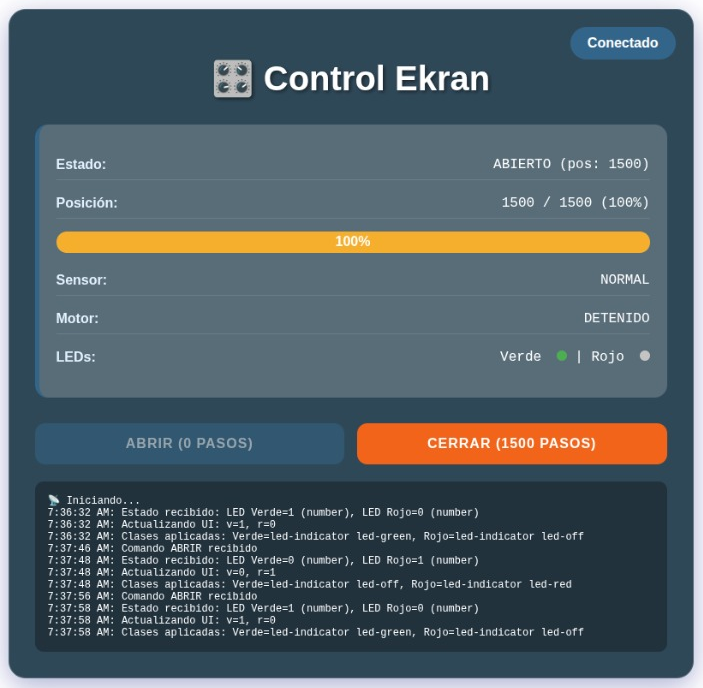

## 5. Sincronización entre Arduino e Interfaz

Una de las características clave del sistema es su capacidad para **mostrar en tiempo real el estado del motor, sensores y LEDs**, así como para **responder a eventos inesperados como obstrucciones**. Esto se logra gracias a un proceso de sincronización constante entre la interfaz web y el servidor embebido en Arduino.

### 5.1 Actualización periódica del estado

Desde que se carga la página, se activa un ciclo continuo de actualizaciones usando la función `monitorStatus()`:

```javascript
fetchStatus().then(() => monitorStatus());
```

Cada 200 milisegundos, esta función llama a `fetchStatus()`, que:

* Hace una petición GET al endpoint `/status`.
* Espera una respuesta JSON con todos los datos del sistema.
* Llama a `updateUI(data)` para actualizar la interfaz visual.

Este enfoque, aunque no utiliza WebSockets, es **suficiente y eficiente en una red local** para mantener sincronía sin complicaciones.

### 5.2 Formato de los datos (JSON)

La respuesta del servidor Arduino incluye los siguientes campos:

```json
{
  "e": "ABRIENDO",
  "p": 600,
  "t": 1500,
  "c": 40,
  "s": "NORMAL",
  "m": "MOVIENDOSE",
  "v": "1",
  "r": "0",
  "o": "0",
  "tr": 0
}
```

Estos campos son interpretados por la interfaz para:

* Mostrar el estado textual (`e`)
* Dibujar la barra de progreso (`c`)
* Activar o desactivar botones según el estado del motor o presencia de obstrucción
* Cambiar colores de los LEDs virtuales
* Mostrar alertas si el sistema está bloqueado (`o === '1'`)

### 5.3 Manejo de interrupciones y sincronización forzada

Si el motor se detiene inesperadamente (por ejemplo, por una obstrucción), el sistema lo detecta automáticamente:

```javascript
if (wasMoving && !isNowMoving && animationFrame) {
    cancelAnimationFrame(animationFrame);
    resetMovementState();
}
```

Esto detiene la animación y fuerza una sincronización directa con el estado real, evitando inconsistencias visuales.

### Tabla de sincronización: JSON → interfaz

| Campo JSON    | Componente visual en la interfaz                           |
| ------------- | ---------------------------------------------------------- |
| `e`           | Estado textual (`#sistemaEstado`)                          |
| `p`, `t`, `c` | Posición y barra de progreso (`#progressBar`, `#posicion`) |
| `s`           | Estado del sensor (`#sensor`)                              |
| `m`           | Estado del motor (`#motor`)                                |
| `v`, `r`      | Indicadores LED (`#ledVerde`, `#ledRojo`)                  |
| `o`, `tr`     | Alerta de obstrucción (`#alertContainer`)                  |

